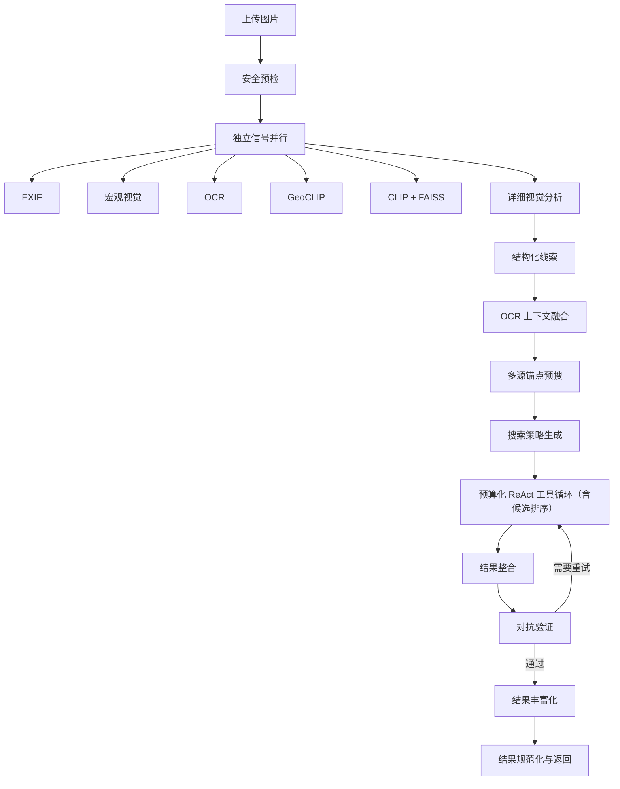

# 系统架构

## 概览

图寻 Agent 是一个前后端分离的图像地理定位实验系统：

- `frontend/`：Vue 3、Pinia、Element Plus 和 Vite。
- `backend/`：FastAPI、LangGraph、Qwen、OCR、GeoCLIP、CLIP/FAISS 和地图服务。
- `/api/task/{id}/stream`：SSE 推送分析步骤、进度、警告和最终结果。
- `backend/data/`：本地索引和知识数据，不纳入 Git。

## 请求流程



## 后端模块

```text
backend/app/
├── agent/          # LangGraph 状态、节点、Prompt 和图编排
├── geolocation/    # 候选排序、坐标、结果规范化和索引契约
├── routers/        # FastAPI 路由
├── safety/         # 人脸、场景和 OCR 安全预检
├── schemas/        # API、事件和证据模型
├── services/       # 任务队列、存储和事件总线
├── tools/          # 地图、搜索、OCR、GeoCLIP、CLIP 等工具
└── utils/          # 图片、SSE 和日志工具
```

任务由 `AgentService` 放入工作队列。事件通过任务级 EventBus 发布，前端断线后可以按事件 ID 重放；任务状态由 TaskRepository 管理。

## 前端模块

```text
frontend/src/
├── api/            # REST 和 SSE 地址
├── components/     # 上传、过程、候选、地图和结果组件
├── composables/    # SSE 生命周期
├── stores/         # Pinia 任务状态
├── types/          # 后端契约对应的 TypeScript 类型
└── views/          # 页面编排
```

任务 ID 保存在 `sessionStorage`，刷新后重新拉取状态；分析期间通过 SSE 增量更新步骤和结果。

## 结果契约

- 内部和 API 坐标统一为 WGS84。
- 未知坐标不能使用 `0,0` 代替。
- `confidence_kind=ranking_score` 时前端显示“候选得分”，不解释为概率。
- `precision_level` 支持国家、省、城市、区县、道路和 POI。
- 缺少模型、地图 Key 或外部服务时，能力状态必须显式降级。
- 工具预算跳过与工具不可用分开统计。

默认不确定半径：国家 1500 km、省 300 km、城市 25 km、区县 10 km、道路 2 km、POI 250 m。该值是定位层级的参考范围，不是统计置信区间。

## 数据与模型

模型权重、FAISS 索引、上传图片和运行日志不提交到 Git。启动时 `/health/ready` 检查索引、模型能力和任务存储；本地已有完整 Hugging Face 快照时，GeoCLIP/CLIP 使用离线模式加载。生产诊断端点为 `/health/live`、`/health/ready` 和 `/metrics`。

## 测试与 CI

- 后端：pytest。
- 前端：Vitest、vue-tsc、ESLint 和 Vite build。
- 浏览器：Microsoft Edge 桌面与移动视口回归。
- GitHub Actions：`.github/workflows/ci.yml`。
